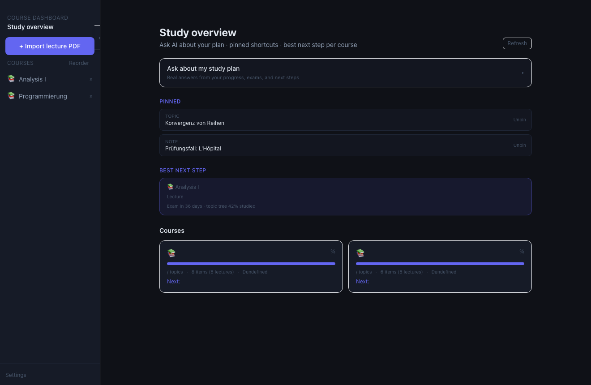

# Course Dashboard

Local-first macOS desktop study hub for university courses. Import lecture PDFs, get AI-generated topic cards, track progress, save notes, link Übung sheets, and practice with an integrated exam coach — all stored in a local vault on your machine.

**Hierarchy:** Course → Lectures / Study units → Topics → Subtopics → Notes & Tutor

## Screenshot

### Study overview — pins, best next step, and course progress

The home dashboard combines pinned shortcuts, an AI study-plan assistant, per-course progress cards, and exam countdowns so you always know what to study next.



## What it does

### Import & structure
- Import **lecture PDFs** — AI extracts topics, subtopics, and tutor-style summary cards
- **Course settings** — per-course AI profile (strength, exam style, focus, difficulty, exam date, ECTS)
- **Promote topic → study unit** — turn a heavy lecture topic into its own mini-unit

### Lecture ↔ Übung (exercise sheets)
- Attach **one or more exercise PDFs** per lecture (Übung 1, Übung 2, …)
- Switch between **Lecture** and **Exercise** material on the same lecture
- Exercise pipeline focuses on **problem types and procedures**, not re-summarizing the lecture
- **Lecture ↔ Übung links** on subtopics jump to related practice material

### Study progress
- Mark **topics** and **subtopics** as studied
- **Subtopic confidence** after marking studied (lecture mode)
- **Progress bar** and **study map** per lecture
- **Study depth badges** on topics

### AI tutor & deeper content
- **Ask tutor** on lectures and topics
- **Ask about saved notes** and **Ask AI on highlighted text**
- **Go deeper** on topics and subtopics (cached expansions)
- **Regenerate** deeper content with feedback chips (German, shorter, more detail, etc.)
- **Language-aware AI** — answers follow lecture/topic language (German/English)
- **KaTeX math** in titles and markdown

### Highlights & notes
- Select text → **Save note**, **Pin to screen**, or **Ask AI**
- **Auto-save** and **AI refine** for highlight notes
- **Note study view** — read, chat, append tutor answers into the note
- **Notes list** — filter by topic, drag reorder, Alt+drag merge
- **Rebuild note metadata** — re-title/repair notes with AI

### Dashboard & pins
- **Home dashboard** — pinned shortcuts, best next step, per-course next step, exam countdown
- **Persistent pins** on lectures, topics, subtopics, and notes
- **Pin to screen** — session-only floating sticky cards over content
- **Ask about my study plan** — dashboard AI chat grounded in your real progress

## Tech stack

| Layer | Technology |
|-------|------------|
| Desktop shell | Electron |
| Frontend | React, Vite, Tailwind CSS |
| PDF processing | pdf-parse, pdfjs-dist |
| Math rendering | KaTeX, react-markdown |
| AI | OpenAI API |
| Storage | Local vault + electron-store |

## Install & run

```bash
npm install
npm run dev
```

Set your OpenAI API key in **Settings**. The key is stored locally and is never committed.

## Build desktop app

```bash
npm run build
```

Packaged output goes to `dist-app/`. Copy a fresh build to Desktop:

```bash
npm run deploy:desktop
```

## Local data

Default vault: `~/Documents/CourseDashboard` (change in **Settings**).

The vault holds source PDFs, extracted text, generated topic cards, notes, pins, and course settings. It is intentionally excluded from Git.

## After cloning

1. `npm install`
2. `npm run dev`
3. Add your OpenAI API key in Settings
4. Import a lecture PDF or point Settings at your vault folder

## Tests

```bash
node scripts/test-exercise-sheets.cjs
node scripts/test-expand-feedback.cjs
node scripts/test-pin-state.cjs
node scripts/test-clean-highlight-text.cjs
node scripts/test-note-title.cjs
node scripts/test-note-routing.cjs
node scripts/test-note-merge.cjs
```

## Related projects

Part of a personal study ecosystem with [StudyAI](https://github.com/zayzyyazy/studyai) and [Exam Practice Coach](https://github.com/zayzyyazy/exam-practice-coach).

## Author

**[zayzyyazy](https://github.com/zayzyyazy)**
